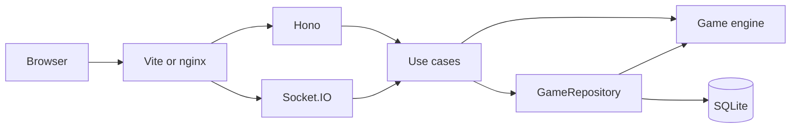

# Beer Distribution Game

A multiplayer supply-chain simulation. Four players each run one station. Orders move upstream, shipments move downstream, and the server is the only thing allowed to change inventory, backlog, or cost.

This repository uses **pnpm**. The script names from the brief still work:

```sh
pnpm install
pnpm dev      # web on http://127.0.0.1:5173, API on http://127.0.0.1:3001
pnpm test
pnpm build
pnpm start    # serves the built web app and the API on port 3001
```

Node 24 is required (`.nvmrc`). `corepack enable` is enough to get pnpm 10.24.

## Demo

There is no hosted demo. Local play is four tabs of one browser:

1. `pnpm dev`
2. Open http://127.0.0.1:5173 and initialize a simulation.
3. Copy the lobby link into three more tabs.
4. Claim Retailer, Wholesaler, Distributor, and Factory. The round starts when the fourth seat is taken.
5. Each station transmits an order. After round 20, open the debrief. The order chart is the bullwhip.

A fifth tab can open **Observer** on the lobby once the game is underway. Observers see who has locked an order. They do not see numbers until the run ends, and they cannot transmit.

## Features

- Four-role Beer Distribution Game, checked against the published 20-round fixture
- Lobby membership over the socket, without polling who has joined
- Server-authoritative rounds, with a per-player view and a separate observer view
- Refresh, disconnect, and a second tab taking over the same seat
- Idempotent order submission
- History, costs, and an orders-versus-demand chart after the game
- Structured logs, `/health`, `/ready`
- Docker Compose and GitHub Actions

## Architecture



```text
apps/server/src/domain/game        pure rules, no I/O
apps/server/src/application/game   create, join, submit, leave, projections
apps/server/src/infrastructure     SQLite, Socket.IO, logs
apps/server/src/http               Hono
apps/web                           React UI
packages/shared                    types, zod schemas, socket event names
```

The shared package has no game rules. The React app has no game rules. Both talk in intents and in views the server already decided were safe to send.

## Why this architecture?

The rules are a pure fold: given the rule card and the order log, the state is determined. That is why `GameEngine` does not import Hono, Socket.IO, SQLite, or React, and why a restart rebuilds the board by replaying `orders` instead of trusting a cached blob.

Around that fold, the layers stay thin on purpose:

- Use cases check who is asking and call the engine.
- The repository writes the new orders and the round read-model in one SQLite transaction.
- HTTP is for create, join, leave, and the debrief. Those are request/response.
- Socket.IO is for the lobby and the live board. Handlers validate a payload and call the same use case HTTP would call.

A single Node process and one SQLite file are enough for four players. Adding Redis or a second service would not make the rules more correct.

## Game rules

The chain is Customer, Retailer, Wholesaler, Distributor, Factory, and an unlimited supplier. Each role starts with inventory 12, backlog 0, shipments `[4, 4]` in transit, and a last order of 4. Customer demand is 4 for rounds 1–4 and 8 for rounds 5–20. Holding cost is 0.5 per unit, backlog cost is 1 per unit. The classic game is 20 rounds. Costs, delay, opening stock, round count, and the demand list can be changed when the game is created.

Each round the server runs these steps for every role from the same pre-round snapshot, then waits:

1. The shipment at the front of the pipeline arrives and is added to inventory.
2. The retailer receives this round's customer demand. Every other role receives the order its downstream neighbor placed last round (the opening 4, in round 1).
3. The role ships `min(inventory, backlog + incoming order)` downstream. What it cannot ship becomes the new backlog. The factory's supplier ships exactly what the factory ordered last round, into the factory's pipeline.
4. Cost for the round is `0.5 × inventory + 1 × backlog`, stored as integer cents.
5. Each player sends an integer order from 0 to 10,000. When all four are in, the server records them and either starts the next round or finishes the game.

Shipments take `shippingDelay` rounds. A new shipment is appended at the end of the pipeline, so with the classic delay of 2 it arrives two rounds after it was shipped. Round 20 still collects orders, matching the fixture, and the UI says that order will not arrive.

Worked checks in `docs/EXAMPLE.md`:

- Everyone orders 4: retailer 394, each upstream role 120, total 754.
- If the retailer orders 8 from round 5 and everyone else keeps ordering 4, the wholesaler first sees 8 in round 6 and the retailer first receives 8 in round 8.

The game starts when the fourth seat is claimed. There is no separate start button.

## Realtime communication

Create and join are HTTP. They return a seat token once. Who is in the lobby, and the live board, are Socket.IO. The lobby page does not poll `GET /api/games/:code`. That route is still there for a one-shot read.

A player connects with `{ gameCode, seatToken }`. An observer connects with `{ gameCode, spectator: true }`. A tab that has not claimed a seat connects with `{ gameCode, lobby: true }`. The server hashes a seat token when one is present, loads the seat, and joins:

- `game:{id}` for public events, including `lobby:updated` (who is seated, the public rules, round started or finished)
- `player:{id}` for that player's `game:state`
- `game:{id}:spectators` for the observer snapshot

A lobby socket joins only `game:{id}`. On connect the server emits the current `lobby:updated`, and it emits that event again when someone claims or leaves a seat. The payload is the public lobby plus a `version`: code, status, round, `roundCount`, `rules`, and `seats`. The client keeps the newest version and drops an older one, and it does not offer a seat until that first payload arrives. A seated player still renders `game:state`. A missing code is `GAME_NOT_FOUND`; the client stops reconnecting and shows that no simulation exists.

`game:state` carries a `version` too. The client drops a snapshot older than the one it already has. Other events (`round:completed`, `session:replaced`, disconnect) are status, not state.

The server sends an Engine.IO ping every 15 seconds and waits 20 seconds for the pong. That is inside nginx's default 60 second proxy read timeout, so an idle socket stays open. The client also emits `connection:ping` every 20 seconds while it is connected. The server acks `{ ok: true, data: { alive: true } }` for lobby, player, and spectator sockets. If that ack does not return within 5 seconds, the client closes the transport and the existing reconnect loop runs.

During a round the public events do not include quantities. A retailer's socket is not in the wholesaler's room, so it never receives the wholesaler's inventory or order. An integration test orders 17 as the wholesaler and asserts that number never appears on the retailer's socket.

## Server authoritative state

The client sends `{ round, submissionId, quantity }`. The server decides whether that round is open, whether this seat already ordered, and what the next inventory and cost are. Zod schemas are strict, so a body that includes `inventory` or `cost` is rejected. The seat's role comes from the token, not from the payload.

## Reconnection strategy

The seat token is stored in `sessionStorage`, which is per tab and survives a reload. That is what makes four tabs four players.

On every player or observer connect the server sends a full `game:state`. A lobby connect sends `lobby:updated`. The UI can rebuild from that alone. If the same token connects again, the new socket wins and the old tab receives `session:replaced`. That tab can take control back, which kicks the other one.

A disconnect is presence only. The seat and any order already saved stay. Reconnect logs `PLAYER_RECONNECTED` only after this process has seen a disconnect, so the first join is not reported as a reconnect.

## Idempotency strategy

Each click creates one `submissionId` and keeps it in `sessionStorage` until the server accepts it. A retry of that same id returns the original result and does not insert a second order. A different id for the same seat and round is `ALREADY_SUBMITTED`. The id is checked before the round number, so a retry that arrives after the round has moved on is still a success, not a new order for the next round.

If the link is down, the client keeps the pending order and transmits it when the socket connects. The same id makes that safe.

## Concurrency handling

Order commands run inside a synchronous `better-sqlite3` transaction, so two submits on one process cannot interleave. The transaction re-reads the game, appends the order, and, if this was the fourth, claims the round:

```sql
UPDATE rounds
SET status = 'processing'
WHERE game_id = ? AND number = ? AND status = 'awaiting_orders'
```

Zero changed rows means the round was already taken, and the transaction rolls back. The unique key `(game_id, round_number, role)` is the same guarantee at the table. The domain function also refuses to process a state that does not have four pending orders, and calling it again on the result throws.

## Database design

SQLite in WAL mode, foreign keys on, Drizzle for queries, SQL migrations applied at startup.

| Table | Role |
| --- | --- |
| `games` | Code, status, current round, version, the immutable rules JSON |
| `players` | Seat, role, SHA-256 of the seat token. Unique `(game_id, role)` |
| `rounds` | One row per round, status `awaiting_orders` → `processing` → `completed` |
| `orders` | The event log. Unique `submission_id` and unique `(game_id, round_number, role)` |
| `round_results` | Read model for the debrief, written in the same transaction as the orders |

The live board is not a JSON document. After a restart the repository folds `orders` through the engine and checks that the header's status and round match. The debrief is read back from `round_results` plus `orders`, so a missing write shows up in tests.

Rules JSON is a value object (costs in cents, delay, opening pipeline, demand). It is not the board.

## Testing strategy

`pnpm test` runs Vitest.

- The engine replays `fixtures/everyone-orders-four.json` for every role, every round, and every field, plus the delay check from `docs/EXAMPLE.md`.
- The repository test plays the classic game, reopens the file, and checks costs, a partial round, and that a finished round cannot be claimed again.
- HTTP tests reject a body that contains `inventory`, seat four players, and read the debrief only after the game ends.
- Socket tests cover a real round, a privacy check, refresh, a duplicate submission, a second tab, an observer who tries to order, a restart, four orders arriving together, a lobby socket that sees a seat get claimed, and a `connection:ping` ack.

The web tests cover cost formatting, stale snapshots, the reconnect banner, and the lobby rendering a seat change from `lobby:updated` without calling `GET /api/games/:code`. They do not pretend to be the rules.

## Observability

Logs are JSON from pino. Each game line has an `event` name and the ids that matter: `gameId`, `playerId`, `role`, `round`, `code`. Events include `GAME_CREATED`, `PLAYER_JOINED`, `PLAYER_DISCONNECTED`, `PLAYER_RECONNECTED`, `GAME_STARTED`, `ORDER_SUBMITTED`, `ROUND_STARTED`, `ROUND_COMPLETED`, and `GAME_FINISHED`.

Seat tokens and token hashes are redacted. HTTP lines carry a request id, method, path, status, and duration, not the body.

`GET /health` is process liveness. `GET /ready` runs `SELECT 1` and checks that the `games` table exists.

## Running locally

```sh
pnpm install
pnpm dev
```

The Vite dev server proxies `/api`, `/health`, `/ready`, and `/socket.io` to port 3001, so the browser talks to one origin.

Production, from a built tree:

```sh
pnpm build
pnpm start
```

`pnpm start` serves `apps/web/dist` and the API from the same Node process. The database file defaults to `apps/server/data/beer-game.sqlite`.

Useful environment variables: `PORT`, `HOST`, `DATABASE_PATH`, `LOG_LEVEL`, `STATIC_DIR`.

## Docker

```sh
docker compose up --build
```

Open http://localhost:8080. `web` is nginx with the built client. It proxies API and Socket.IO to `server`. SQLite lives on the `sqlite-data` volume at `/data/beer-game.sqlite`.

## CI

`.github/workflows/ci.yml` runs on pull requests and on pushes to `main`:

```text
pnpm install --frozen-lockfile
pnpm typecheck
pnpm lint
pnpm test
pnpm build
```

The job fails if any step fails.

## Technical trade-offs

- **HTTP for join, sockets for the lobby and for play.** A seat token is easier to store and retry as a normal response than as a socket ack during a page load. Before a seat is claimed, and after each claim, membership moves on `lobby:updated` instead of a repeating GET.
- **Orders are the log, `round_results` is a projection.** Replay keeps one implementation of the rules. The table makes the debrief a query and makes a missed write obvious.
- **Costs are integer cents.** A rate of 0.5 never becomes a binary float.
- **In-memory presence.** Who is connected is not durable. Who is seated is. A restart clears the green lamps and the next connect restores them.
- **No login.** The game code plus the seat token is the capability. That matches a four-player review session. It is not an account system.
- **Future demand is not in the snapshot.** Players learn it from the orders that arrive. The debrief shows it afterwards, which is what the bullwhip chart needs.
- **Round 20 still takes orders.** The fixture records `orderPlaced` for that round. The UI says the order will not be delivered.

## What I would improve at scale

Today this is one Node process and one SQLite writer. That is the right size: four players, a few games, and a transaction that already serializes a round.

The first limit is that writer plus the in-process socket rooms. Two API instances would each have their own rooms and their own memory of who is connected, and SQLite does not like many writers.

If the game had many concurrent rooms:

- Move the database to PostgreSQL. The schema is already relational. Keep the order log and the same compare-and-set on the round row.
- Put Socket.IO on the Redis adapter so a reconnect can land on any instance. Still send a full snapshot after connect. Do not invent a diff protocol first.
- Give each game one writer. Sticky sessions, or a single owner per game id, keep the "process this round once" rule without a distributed lock in the hot path.
- Keep the engine pure. Scaling changes the repository and the socket fan-out, not the rules.

I would not start with Redis, Kafka, or extra services for this challenge. They would add failure modes without teaching a reviewer anything about the game.

## What I would do next

- A short bot that fills empty seats using only that seat's own view
- A clock so a stalled round can be resolved instead of waiting forever
- Rate limits on create and join

## How this was built

An AI coding assistant implemented the project from the task brief, `docs/EXAMPLE.md`, the fixture, and an architecture note that asked for a pure engine, authoritative state, reconnect, and idempotency. The fixture and the task README decided the rules when they disagreed with that note. I can walk through the engine, the order log, and the socket rooms line by line.
